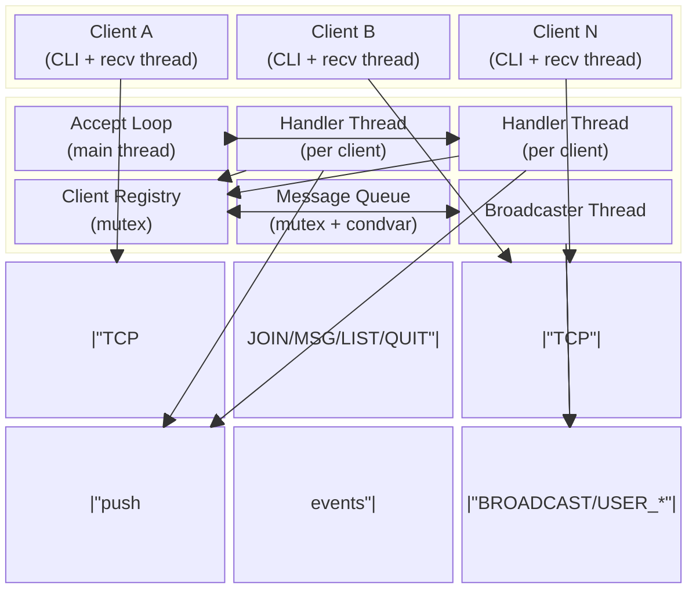
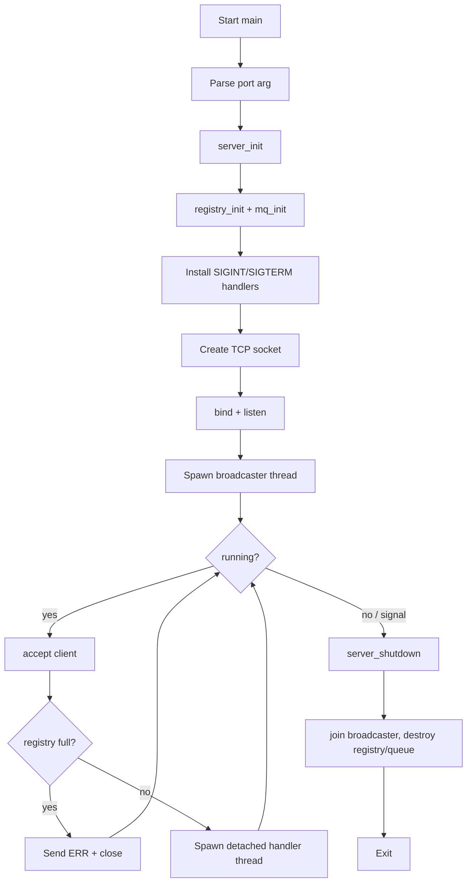
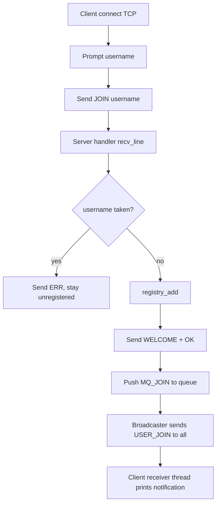
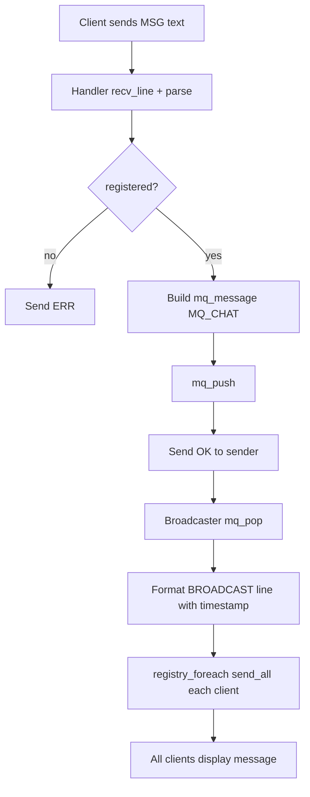
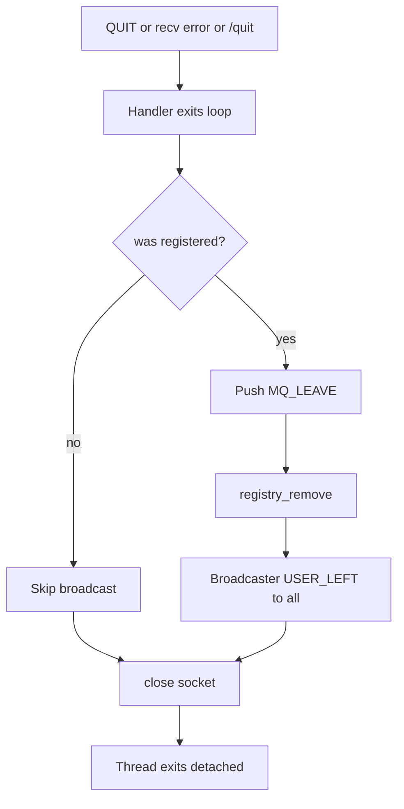

# Design Document — Real-Time Multi-User Chat Application

This document describes the architecture, concurrency model, protocol, and operational characteristics of the TCP chat system implemented in C for Fedora Linux.

---

## 1. Complete Project Architecture

The system follows a **layered, modular architecture** with clear separation between transport, protocol, application logic, and presentation.

### Layers

| Layer | Components | Responsibility |
|-------|------------|----------------|
| **Presentation** | `src/client/main.c`, `src/client/client.c` | CLI I/O, user interaction, receiver thread for inbound server messages |
| **Application (Server)** | `server.c`, `client_registry.c`, `broadcaster.c` | Connection lifecycle, command dispatch, user registry, broadcast orchestration |
| **Protocol** | `protocol.c` | Parse/build line-oriented text commands; isolate wire format from business logic |
| **Infrastructure** | `message_queue.c`, `utils.c` | Thread-safe queue, socket helpers, timestamps |
| **Shared Types** | `include/*.h` | Constants, structs, public APIs |

### Component Responsibilities

- **Main (server)**: Parse CLI port argument, initialize server, install signal handlers, run accept loop, clean shutdown.
- **Server core (`server.c`)**: Create listening socket, accept connections, spawn detached per-client handler threads, route commands.
- **Client registry (`client_registry.c`)**: Mutex-protected singly linked list of connected users; duplicate detection; user list generation.
- **Broadcaster (`broadcaster.c`)**: Consumer thread reading from message queue; formats protocol lines and sends to all registered sockets.
- **Message queue (`message_queue.c`)**: Producer-consumer buffer between client handler threads and broadcaster.
- **Protocol (`protocol.c`)**: Stateless encode/decode of `JOIN`, `MSG`, `LIST`, `QUIT` and server responses.
- **Client (`client.c`)**: Connect to server, send JOIN, run input loop and background receiver thread.

### Architectural Pattern

The server uses a **WhatsApp-like hub model**: one central process owns all client sockets. Chat messages are not sent peer-to-peer; the server receives a message and rebroadcasts it to every connected client (including the sender), ensuring consistent ordering and simple client logic.

---

## 2. Folder Structure

```
OS-LAB-CHAT/
├── README.md                 # Build/run instructions and quick reference
├── Makefile                  # Builds server, client, and tests
├── docs/
│   └── DESIGN.md             # This document
├── include/
│   ├── common.h              # Shared constants, status codes
│   ├── protocol.h            # Command/response types and protocol API
│   ├── server.h              # Server state struct and lifecycle API
│   ├── client.h              # Client state struct and lifecycle API
│   ├── client_registry.h     # Online user registry API
│   ├── message_queue.h       # Thread-safe broadcast queue API
│   └── utils.h               # Socket and string utilities
├── src/
│   ├── server/
│   │   ├── main.c            # Server entry point
│   │   ├── server.c          # Accept loop, client handler threads, command routing
│   │   ├── client_registry.c # Registry implementation
│   │   └── broadcaster.c     # Broadcast consumer thread
│   ├── client/
│   │   ├── main.c            # Client entry point
│   │   └── client.c          # Connection, input loop, receiver thread
│   └── common/
│       ├── protocol.c        # Protocol parse/build functions
│       ├── message_queue.c   # FIFO queue with mutex + condvar
│       └── utils.c           # send_all, recv_line, timestamps, port parsing
└── tests/
    ├── test_protocol.c       # Unit tests for protocol parsing
    └── test_registry.c       # Unit tests for client registry
```

---

## 3. Block Diagram



### ASCII Equivalent

```
  +----------+     +----------+     +----------+
  | Client A |     | Client B |     | Client N |
  +----+-----+     +----+-----+     +----+-----+
       | TCP            | TCP            | TCP
       +----------------+----------------+
                        |
                 +------v------+
                 | Accept Loop |  (main thread)
                 +------+------+
                        | spawns
          +-------------+-------------+
          |                           |
   +------v------+             +------v------+
   | Handler T1  |             | Handler T2  |  (thread-per-client)
   +------+------+             +------+------+
          | push                      | push
          +-------------+-------------+
                        |
                 +------v------+
                 | Message Q   |  (mutex + condvar)
                 +------+------+
                        |
                 +------v------+
                 | Broadcaster |  (dedicated thread)
                 +------+------+
                        | read registry, send_all
          +-------------+-------------+
          |             |             |
     Client A      Client B      Client N

   +------------------+
   | Client Registry  |  (mutex-protected linked list)
   +------------------+
```

---

## 4. Flowchart

### 4.1 Server Startup



### 4.2 Client Connect & Registration



### 4.3 Message Broadcast



### 4.4 Client Disconnect



---

## 5. Data Structures

### 5.1 `client_node_t` (Registry Entry)

| Field | Type | Description |
|-------|------|-------------|
| `sockfd` | `int` | Connected TCP socket file descriptor (unique per session) |
| `username` | `char[MAX_USERNAME_LEN]` | Display name chosen at JOIN (max 31 chars + NUL) |
| `next` | `struct client_node *` | Pointer to next node in singly linked list |

### 5.2 `client_registry_t`

| Field | Type | Description |
|-------|------|-------------|
| `head` | `client_node_t *` | Head of linked list of online clients |
| `count` | `size_t` | Current number of registered clients |
| `lock` | `pthread_mutex_t` | Protects list mutations and traversals |

### 5.3 `mq_message_t` (Broadcast Event)

| Field | Type | Description |
|-------|------|-------------|
| `type` | `mq_event_type_t` | `MQ_CHAT`, `MQ_JOIN`, `MQ_LEAVE`, or `MQ_SHUTDOWN` |
| `username` | `char[MAX_USERNAME_LEN]` | Originating user for chat/join/leave events |
| `content` | `char[MAX_MSG_LEN]` | Chat message body (empty for join/leave) |
| `timestamp` | `time_t` | Unix epoch time set at event creation |

### 5.4 `message_queue_t`

| Field | Type | Description |
|-------|------|-------------|
| `head`, `tail` | `mq_node_t *` | FIFO linked list of pending messages |
| `count` | `size_t` | Queue depth |
| `shutdown` | `bool` | Set true to wake broadcaster for exit |
| `lock` | `pthread_mutex_t` | Protects queue state |
| `not_empty` | `pthread_cond_t` | Signals broadcaster when messages arrive |

### 5.5 `chat_server_t`

| Field | Type | Description |
|-------|------|-------------|
| `listen_fd` | `int` | Listening socket |
| `port` | `uint16_t` | Bound TCP port |
| `running` | `volatile int` | Accept loop control flag (signal-safe write) |
| `registry` | `client_registry_t` | Online users |
| `broadcast_queue` | `message_queue_t` | Pending broadcast events |
| `broadcaster_tid` | `pthread_t` | Broadcaster thread handle |

### 5.6 `chat_client_t`

| Field | Type | Description |
|-------|------|-------------|
| `sockfd` | `int` | Connection to server |
| `username` | `char[MAX_USERNAME_LEN]` | Local username |
| `running` | `volatile int` | Controls input and receiver loops |

### 5.7 Protocol Parse Structs

**`parsed_cmd_t`** — result of parsing a client line:

| Field | Description |
|-------|-------------|
| `cmd` | `CMD_JOIN`, `CMD_MSG`, `CMD_LIST`, `CMD_QUIT` |
| `arg1` | Username for JOIN |
| `arg2` | Message body for MSG |

**`parsed_resp_t`** — result of parsing a server line:

| Field | Description |
|-------|-------------|
| `type` | Response kind (WELCOME, BROADCAST, etc.) |
| `username`, `message`, `timestamp`, `user_list` | Payload fields depending on type |

---

## 6. Threading Model

### Threads

| Thread | Count | Role |
|--------|-------|------|
| **Main / accept** | 1 | `bind`, `listen`, `accept`, spawn handlers, react to shutdown |
| **Client handler** | 1 per connected TCP client | Read commands, update registry, enqueue broadcasts |
| **Broadcaster** | 1 | Dequeue events, format lines, `send_all` to all clients |
| **Client receiver** (client side) | 1 per client process | Block on `recv_line`, print server pushes |

### Concurrency Choice: Thread-Per-Client

**Selected:** thread-per-client (detached `pthread_create` on each `accept`).

**Why not a thread pool?**

- Simpler to implement and reason about for an OS lab (direct mapping: 1 TCP session → 1 thread).
- Blocking `recv_line` per client is natural without an event loop or non-blocking I/O complexity.
- Expected scale (tens of clients, not thousands) keeps thread overhead acceptable on Fedora.

**Trade-off:** High connection churn creates thread creation cost; a pool would amortize that at the cost of more complex job scheduling.

### Synchronization Primitives

| Resource | Primitive | Usage |
|----------|-----------|-------|
| Client registry | `pthread_mutex_t` | All add/remove/lookup/list/foreach operations |
| Message queue | `pthread_mutex_t` + `pthread_cond_t` | Producer handlers push; broadcaster waits on `not_empty` |
| `running` flags | `volatile int` | Written by signal handler / main; read by worker loops |
| Socket sends from broadcaster | Registry mutex during foreach | Snapshot each node under lock, unlock before `send_all` to avoid holding lock during I/O |

### Deadlock Avoidance

- Single lock ordering: handlers never hold registry lock while waiting on queue.
- Queue lock is never acquired while holding registry lock.
- `registry_foreach` releases mutex before blocking I/O.

---

## 7. Memory Management Strategy

### Allocation Ownership

| Object | Allocator | Owner | Freed When |
|--------|-----------|-------|------------|
| `client_node_t` | `malloc` in `registry_add` | Registry | `registry_remove` or `registry_destroy` |
| `mq_node_t` | `malloc` in `mq_push` | Message queue | `mq_pop` (after copy) or `mq_destroy` |
| `client_thread_arg_t` | `malloc` in accept loop | Handler thread | Freed at start of `client_handler` |
| Stack buffers (`line`, `buf`) | stack | Function frame | Automatic |

### Cleanup on Disconnect

1. Handler thread exits command loop.
2. If registered: enqueue `MQ_LEAVE`, then `registry_remove` (frees node).
3. `close(client_fd)`.
4. No explicit thread join (detached).

### Server Shutdown

1. Set `running = 0`, close listen socket.
2. Signal queue shutdown + push sentinel message.
3. `pthread_join` broadcaster (drains or exits on sentinel).
4. `mq_destroy` frees remaining nodes.
5. `registry_destroy` frees all client nodes (sockets should already be closed by handlers).

### Valgrind Notes

Run with:

```bash
valgrind --leak-check=full --show-leak-kinds=all ./build/chat_server
```

Expected clean shutdown path:

- All `client_node_t` freed via `registry_remove` or `registry_destroy`.
- All `mq_node_t` freed via `mq_pop` or `mq_destroy`.
- Handler `malloc(targ)` freed at thread entry.

**Known acceptable allocations:** pthread library internal structures; Valgrind may report still-reachable blocks from libc/pthread — focus on **definitely lost** and **indirectly lost** counts being zero.

---

## 8. Socket Communication Workflow

### Handshake Sequence

1. Client `socket()` + `connect()` to server host:port.
2. Client prompts for username locally, sends `JOIN <username>\n`.
3. Server validates username uniqueness, adds to registry.
4. Server replies `WELCOME <username>\n` then `OK joined successfully\n`.
5. Server enqueues join event; broadcaster sends `USER_JOIN <username>\n` to all clients.

### Wire Protocol

- **Framing:** newline-delimited lines (`\n` terminator).
- **Encoding:** UTF-8 plain text (ASCII subset for usernames recommended).
- **Commands:** space-separated verb + arguments.

### Read/Write Loops

**Server handler:**

```
while (running):
    recv_line(fd, buf)
    parse command
    dispatch JOIN | MSG | LIST | QUIT
```

**Client:**

- Main thread: `fgets` stdin → build protocol line → `send_all`.
- Receiver thread: `recv_line` → parse → print formatted output.

**Reliability:** `send_all` loops until full buffer sent; partial sends handled. `recv_line` reads byte-by-byte until `\n` or disconnect.

### Broadcast Path

Handler pushes `mq_message_t` → broadcaster pops → builds `BROADCAST user timestamp msg\n` → iterates registry → `send_all` to each fd.

---

## 9. Error Handling Strategy

### Status Codes (`chat_status_t`)

| Code | Meaning |
|------|---------|
| `CHAT_OK` | Success |
| `CHAT_ERR` | Generic failure |
| `CHAT_ERR_NOMEM` | `malloc` failed |
| `CHAT_ERR_PROTOCOL` | Malformed line |
| `CHAT_ERR_DUPLICATE` | Username taken (application level) |
| `CHAT_ERR_NOT_FOUND` | Registry lookup miss |
| `CHAT_ERR_IO` | Socket read/write failure |
| `CHAT_ERR_FULL` | `MAX_CLIENTS` reached |

### errno Handling

- System calls (`accept`, `bind`, `send`, `recv`) log via `perror` on the server for unexpected failures.
- `EINTR` on `send`/`recv`/`accept`: retry or break loop as appropriate.
- Client I/O failure sets `running = 0` and exits cleanly.

### Client Errors vs Server Errors

| Situation | Behavior |
|-----------|----------|
| Bad client command | `ERR <reason>\n`, connection stays open |
| Duplicate username | `ERR username already taken\n`, not registered |
| Unregistered MSG/LIST | `ERR not registered\n` |
| Client disconnect / reset | Handler breaks loop, cleanup, optional USER_LEFT broadcast |
| Server full | `ERR server full\n` before spawning handler |
| SIGINT/SIGTERM | Stop accept, join broadcaster, free resources |

### Graceful Shutdown

Signal handler sets `g_server->running = 0` (async-signal-safe). Main loop exits, `server_shutdown` closes listen fd, wakes broadcaster, joins thread, destroys structures.

---

## 10. Testing Strategy

### Unit Tests (`make test`)

| Test Binary | Scope |
|-------------|-------|
| `test_protocol` | Client command parsing, BROADCAST/LIST round-trip build+parse, invalid JOIN |
| `test_registry` | init/add/count/exists/list/remove/destroy |

Tests print `PASS`/`FAIL` per assertion and return non-zero exit code on failure.

### Integration Tests (Manual)

1. Start server on port 8080.
2. Connect two clients with distinct usernames.
3. Verify WELCOME, USER_JOIN notifications.
4. Send messages both directions; verify timestamps and ordering.
5. `/list` shows both users.
6. Quit one client; other sees USER_LEFT.
7. Attempt duplicate username; verify ERR.
8. Ctrl+C server; verify clean exit.

### Load Testing (Manual)

```bash
# Example: 10 clients in background (bash loop)
for i in $(seq 1 10); do
  echo -e "user$i\nHello from user$i\n/quit" | ./build/chat_client &
done
wait
```

Observe server logs, CPU usage, and absence of crashes. For lab scale, thread-per-client handles 10–50 clients comfortably.

### Valgrind Regression

After integration session:

```bash
valgrind --error-exitcode=1 --leak-check=full ./build/chat_server
```

Connect/disconnect clients, then shutdown. Treat any **definitely lost** bytes as a bug.

### Future Automated Integration Tests

Potential extensions (not implemented):

- Fork/exec server + Python/expect script driving multiple TCP clients.
- CI job on Fedora runner: `make test && make all`.

---

## Advanced Features (v2)

### Authentication (`auth.c`)
- Users must send `AUTH username password` before any other command.
- Passwords stored as SHA-256 hex in `data/users.db` (OpenSSL EVP).
- Admin flag per user enables `/kick` (server command `KICK`).

### Chat Rooms (`room_manager.c`)
- Each client has one active room (default `lobby`).
- `JOIN_ROOM` switches rooms; old room gets `USER_LEFT`, new room gets `USER_JOIN`.
- `MSG` broadcasts only to clients in the same room.

### Message History
- Ring buffer per room (max 100 entries).
- Sent automatically on `AUTH` (lobby) and `JOIN_ROOM`.
- `HISTORY` command re-requests current room history.

### Private Messaging
- `PM target message` delivered directly to target socket (not via broadcaster).
- Client shortcut: `@target message`.

### Admin Kick
- Admin sends `KICK username`; server sends `KICKED` to target and `shutdown()` socket.

### Client Colors (`colors.c`)
- ANSI colors when stdout is a TTY; disabled when piped.

### Thread Safety
| Resource | Mutex |
|----------|-------|
| Client registry | `registry.lock` |
| Room history | `rooms.lock` |
| User database | `auth.lock` (read-mostly) |
| Broadcast queue | `queue.lock` + condvar |
| Connection count | `srv.conn_lock` |

---

## Protocol Reference (v2)

### Client → Server

| Command | Format | Description |
|---------|--------|-------------|
| AUTH | `AUTH <user> <pass>` | Authenticate (required first) |
| JOIN_ROOM | `JOIN_ROOM <room>` | Switch chat room |
| MSG | `MSG <text>` | Room broadcast |
| PM | `PM <user> <text>` | Private message |
| LIST | `LIST` | Online users |
| HISTORY | `HISTORY` | Current room history |
| KICK | `KICK <user>` | Admin disconnect user |
| QUIT | `QUIT` | Disconnect |

### Server → Client

| Response | Format |
|----------|--------|
| WELCOME | `WELCOME <username>` |
| ROOM_JOINED | `ROOM_JOINED <room>` |
| BROADCAST | `BROADCAST <user> <timestamp> <room> <text>` |
| PM | `PM <from> <timestamp> <text>` |
| USER_JOIN | `USER_JOIN <user> <room>` |
| USER_LEFT | `USER_LEFT <user> <room>` |
| HISTORY | `HISTORY <user\|ts\|msg\|\|...>` |
| KICKED | `KICKED <reason>` |
| LIST | `LIST <user1,user2,...>` |
| OK / ERR | `OK/ERR <message>` |

---

## Summary of Key Design Decisions

1. **Thread-per-client** for clarity and direct blocking I/O.
2. **Dedicated broadcaster thread** decouples slow `send_all` fan-out from command processing.
3. **Mutex-protected registry, rooms, and auth DB** ensure thread-safe shared state.
4. **Room-scoped broadcasts** via room field in registry + filtered foreach.
5. **Bounded ring-buffer history** per room — no unbounded memory growth.
6. **SHA-256 password hashes** — no plaintext credentials on disk.
7. **Line-based text protocol** for debuggability with `telnet` or `nc`.
8. **Explicit ownership** for all heap nodes with cleanup on disconnect and shutdown.
